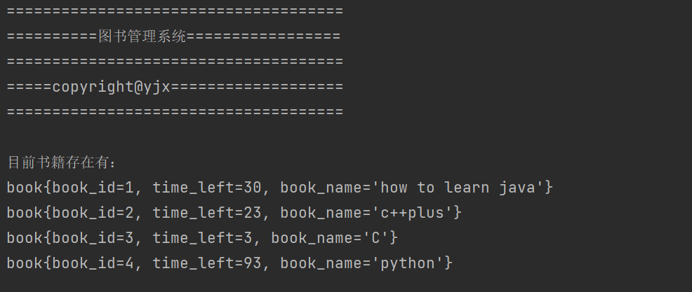

## 项目目的

仿照饿了么订餐系统，做了个精简的图书馆管理系统，可以用JDBC连接MySQL数据库，然后增删里面的书籍

## GitHub地址：https://github.com/F000top/Book_Management


## 简介：

数据库：图书馆书籍管理


里面有两张表：


分别是:book_information(书籍编号、书籍名字、剩余归还时间)和user(用户id、用户姓名、和借阅书籍的id)


采用JDBC连接这个数据库，实现数据的增加和删除


## 代码实现

### 创建book类

```java
public class book {
    //book_id 和 time_left 在数据库里面是 int ,但是这里给他弄了个Integer
    private Integer book_id;
    private Integer time_left;
    private String book_name;

    public book(Integer book_id,Integer time_left,String book_name){
        super();
        this.book_id=book_id;
        this.book_name=book_name;
        this.time_left=time_left;
    }

    public book(String book_name){
        super();
    }


    public Integer getBook_id() {
        return book_id;
    }

    public Integer getTime_left() {
        return time_left;

    }

    public String getBook_name() {
        return book_name;
    }

    public void setBook_id(Integer book_id) {
        this.book_id = book_id;
    }

    public void setBook_name(String book_name) {
        this.book_name = book_name;
    }

    public void setTime_left(Integer time_left) {
        this.time_left = time_left;
    }

    @Override
    public String toString() {
        return "book{" +
                "book_id=" + book_id +
                ", time_left=" + time_left +
                ", book_name='" + book_name + '\'' +
                '}';
    }
}
```


### 查询函数

```java
//查询函数，静态方法,可以直接调用
    public static void select(){
        try {
            //加载驱动
            Class.forName("com.mysql.jdbc.Driver");


        } catch (ClassNotFoundException e) {
            throw new RuntimeException(e);
        }


        Connection conn=null;
        Statement stat=null;
        ResultSet rs=null;
        //获取连接
        try {
            conn=DriverManager.getConnection(url,user,password);

            String sql="SELECT *FROM book_information";

            stat=conn.createStatement();

            rs = stat.executeQuery(sql);

            while (rs.next()){
                String book_id = rs.getString("book_id");
                String book_name = rs.getString("book_name");
                String time_left = rs.getString("time_left");

                //Integer.parseInt()的作用是转换类型，把string变成Integer

                book b=new book(Integer.parseInt(book_id),Integer.parseInt(time_left),book_name);
//               备份一个正确的写法，这几个换位置了就会报错，估计是数据类型不批匹配的原因
//               book b=new book(Integer.parseInt(book_id),Integer.parseInt(time_left),book_name);
                System.out.println(b);
            }
        } catch (SQLException e) {
            throw new RuntimeException(e);
        }finally {

            //关闭conn
            try {
                conn.close();
            } catch (SQLException e) {
                throw new RuntimeException(e);
            }

            //关闭stat
            try {
                stat.close();
            } catch (SQLException e) {
                throw new RuntimeException(e);
            }

            //关闭rs
            try {
                rs.close();
            } catch (SQLException e) {
                throw new RuntimeException(e);
            }

        }

    }
```


### 删除函数

```java
//删除的函数，参数是删除哪一本书book
        public static void delete(book b){
        //copy上面那个select函数，连接JDBC的过程是一样的
            try {
                //加载驱动
                Class.forName("com.mysql.jdbc.Driver");
            } catch (ClassNotFoundException e) {
                throw new RuntimeException(e);
            }


            Connection conn=null;
            Statement stat=null;


            //获取连接
            try {
                conn=DriverManager.getConnection(url,user,password);
                /*
                PreparedStatement介绍
            表示预编译的SQL语句的对象。
            SQL语句已预编译并存储在PreparedStatement对象中。 然后可以使用该对象多次有效地执行此语句。
                 */
//               sql语句 DELETE FROM book_information WHERE book_id=4;
                String sql ="DELETE FROM book_information WHERE book_id=?";
                PreparedStatement ps=conn.prepareStatement(sql);
                ps.setInt(1,b.getBook_id());
                ps.executeUpdate();


            } catch (SQLException e) {
                throw new RuntimeException(e);
            }finally {

                //关闭conn
                try {
                    conn.close();
                } catch (SQLException e) {
                    throw new RuntimeException(e);
                }

                //关闭stat
                try {
                    stat.close();
                } catch (SQLException e) {
                    throw new RuntimeException(e);
                }


            }

        }


```


### 主函数

```java
  public static void main(String[] args) {
        System.out.println("=====================================");
        System.out.println("==========图书管理系统=================");
        System.out.println("=====================================");
        System.out.println("=====copyright@yjx===================");
        System.out.println("=====================================\n");
        System.out.println("目前书籍存在有：");

        //调用查询函数,查询借阅的书籍
        select();
      //创建一个book对象
      	book b=new book();
        delete(b);


    }
```


运行截图：



运行之后发现第四行被删除


